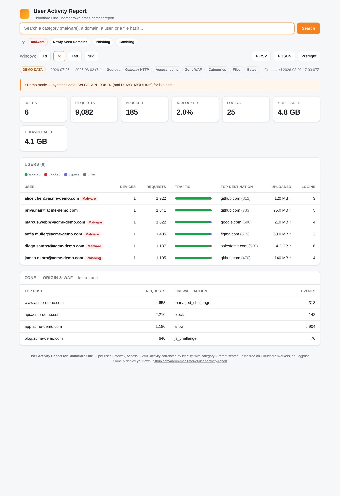
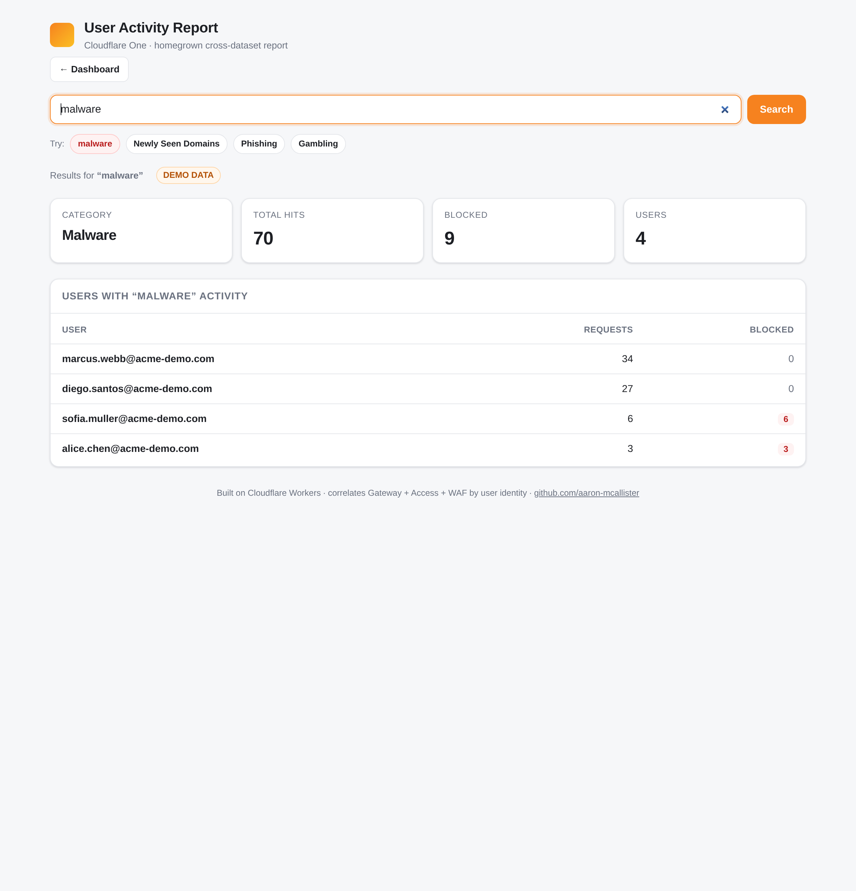
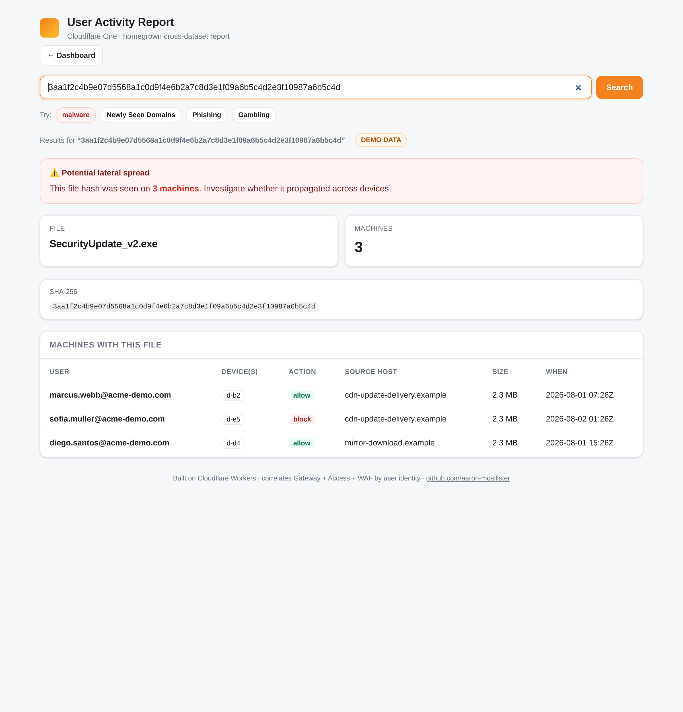
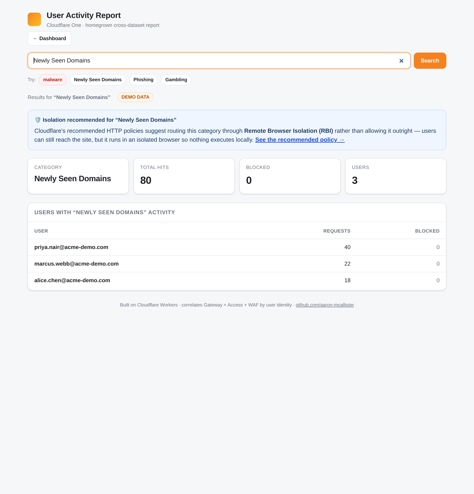
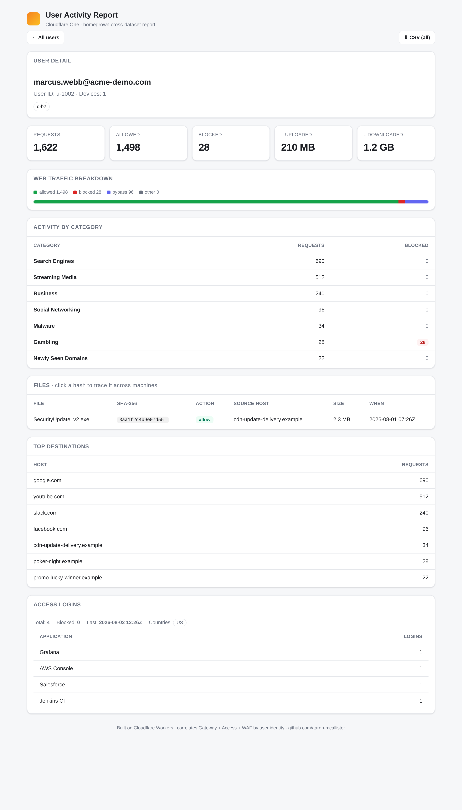

# User Activity Report for Cloudflare One

A homegrown, **per-user activity report** for Cloudflare One — the kind of report
Log Explorer can't produce today because it can't join across datasets. It runs on a
**Cloudflare Workers free plan**, needs **no Logpush**, and you can stand it up in a
few minutes.

> A self-hosted **user activity report** for Cloudflare One — per-user visibility across
> Gateway, Access, and WAF, built entirely on Cloudflare primitives.

> ⚠️ Personal open-source project — **not an official Cloudflare product** and not
> supported by Cloudflare. MIT licensed; use at your own risk.

---

## The gap this fills

Cloudflare's Log Explorer has come a long way — custom dashboards, tabs, pivots — but
today it **queries one dataset at a time**. It can't *join* Gateway HTTP activity to
Access logins to WAF events for a single person. So there's no native, per-user
"here's everything this user did" view.

**This project does the join in the app instead.** It pulls each dataset through its
own free-tier API and correlates them on **user identity** (`email` / `userId` /
`deviceId`):

| Dataset | Source (free tier) | Per-user? | Contributes |
|---|---|---|---|
| Gateway HTTP (L7) | GraphQL Analytics API — `gatewayL7RequestsAdaptiveGroups` | ✅ email / userId / deviceId | Web activity, allow/block/bypass, top destinations, **content/security categories** |
| Gateway DNS | GraphQL — `gatewayResolverQueriesAdaptiveGroups` | by category (account-level) | Category activity (e.g. Security Threats) across the account |
| Access logins | REST — `/access/logs/access_requests` | ✅ user_email / user_id | App logins, IdP, allowed/blocked, country |
| Zone HTTP + WAF | GraphQL — `httpRequestsAdaptiveGroups`, `firewallEventsAdaptiveGroups` | by host / action | Origin traffic + security events for your own zones |

The result is a comprehensive per-user activity report: activity totals, allowed vs
blocked vs bypass, top domains, **category breakdown**, login history — with drill-down
per user and CSV/JSON/PDF export, plus top-level search by category, domain, or user.

---

## Screenshots

**Dashboard** — per-user activity, traffic breakdown, data transferred, top destinations:



**Top-level search & threat hunting** — search a category, a domain, a user, or a **file hash**:

| Search “malware” | File-hash lateral spread |
|---|---|
|  |  |

| “Newly Seen Domains” → Isolated per best practices | Per-user drill-down |
|---|---|
|  |  |

### A worked threat-hunting flow
1. **Search `malware`** → see which users have malware-category hits.
2. **Open a user** → their full activity, including a downloaded file and its **SHA-256**.
3. **Click the hash** (or search it) → every machine that has the same file — instant
   **lateral-spread** view. This is the pivot Log Explorer can't do.

*(All screenshots use built-in **demo mode** — synthetic data, no real people. Search
categories, file hashes, and bytes-transferred are demo-only today; see
[Limitations](#limitations--honesty) for what's live on the free tier vs. Enterprise.)*

---

## How it works

```
   Cloudflare GraphQL API ─┐
   (Gateway HTTP, Zone WAF) │      ┌─────────────────────────────────────┐
                            ├────▶ │  Cloudflare Worker (this repo)        │
   Access REST API ─────────┘      │  • fetch each dataset (free-tier API) │ ──▶  Per-user report UI
   (/access/logs/...)              │  • JOIN by email / userId / deviceId  │       + CSV / JSON export
                                   │  • aggregate + render                 │
                                   │  • (optional) snapshot to R2          │ ──▶  R2 = your own history
                                   └─────────────────────────────────────┘
```

No database, no build step beyond Wrangler, no external services. Just a Worker that
calls Cloudflare's own APIs and renders HTML.

---

## Tiers

**Free (default).** Clone, `wrangler deploy`, done — **$0** on Workers Free. The Worker
queries the APIs on demand and renders the report, storing nothing. Retention is whatever
your plan exposes (short — see [Limitations](#limitations--honesty)).

- **Optional: keep your own history (still free).** Turn on retention and the Worker
  snapshots each pull into **R2** (free up to 10 GB) as NDJSON, so history survives beyond
  the platform's short analytics window — still **$0** for most orgs. It's a one-step
  opt-in (create a bucket + uncomment a block in `wrangler.jsonc`); the default stays
  stateless so the zero-config deploy always just works. See
  [docs/deploy.md](docs/deploy.md#retention).

**Enterprise (cross-dataset SQL, incl. DLP).** For customers who own Cloudflare One + WAF
and will buy some R2: pipe raw events via **Logpush → R2 → R2 Data Catalog** and run true
cross-dataset **SQL joins** (including **DLP × HTTP**) with **R2 SQL**. Logpush requires an
**Enterprise** plan. This is the Enterprise mirror of the Log Explorer join gap. See
[docs/enterprise-r2-sql.md](docs/enterprise-r2-sql.md).

---

## Quickstart

### Prerequisites
- Node 18+ and a Cloudflare account (the **free** plan is fine).
- For real per-user web data: **Cloudflare One Gateway** with HTTP filtering and
  **WARP** deployed (so requests carry user identity). No WARP → no per-user L7 rows.

### 1. Clone & install
```bash
git clone https://github.com/aaron-mcallister/cf-user-activity-report.git
cd cf-user-activity-report
npm install
```

### 2. Try it with demo data (no token needed)
```bash
npm run dev        # open http://localhost:8787 — synthetic data
```

### 3. Point it at your account (optional)

Demo mode already works — do this only when you want to see **your** account's real data
instead of the sample.

**a. Create a read-only API token** (about 2 minutes). Full click-by-click walkthrough in
[docs/token-scopes.md](docs/token-scopes.md). In short, at
[dash.cloudflare.com/profile/api-tokens](https://dash.cloudflare.com/profile/api-tokens) →
**Create Custom Token**, with:
- Account → **Account Analytics** → Read
- Account → **Access: Audit Logs** → Read
- Zone → **Analytics** → Read *(optional, for WAF/origin)*

**b. Hand the token to the app** — run this and paste the token when it asks (no file
editing, no code):
```bash
npm run setup
```

**c. See your data:**
```bash
npm run preflight   # optional: confirms your plan exposes the data
npm run dev         # open http://localhost:8787 — now showing your account
```

That's it. To go back to the sample data later, delete the `.dev.vars` file the setup
created (or run `npm run setup` again to change the token).

<details>
<summary><b>Prefer to set it up by hand?</b> (instead of <code>npm run setup</code>)</summary>

`npm run setup` just writes a small file called `.dev.vars` for you. To create it
yourself, run these two lines — replace <code>YOUR_TOKEN</code> with the token you copied
(keep the quotes):
```bash
echo 'CF_API_TOKEN="YOUR_TOKEN"' > .dev.vars
echo 'DEMO_MODE="off"' >> .dev.vars
```
Then `npm run dev`. (Optional: add a line `CF_ACCOUNT_ID="..."` if the token can see more
than one account.) You can also copy `.dev.vars.example` to `.dev.vars` and edit it in any
text editor.
</details>

### 4. Deploy

Log in once (this opens your browser):
```bash
npx wrangler login
```

Then deploy:
```bash
npm run deploy
```
- With **no token set**, the deployed site shows the **sample data** — safe to share.
- To show **your real data**, add your token (Wrangler prompts you to paste it) and deploy
  again:
  ```bash
  wrangler secret put CF_API_TOKEN
  npm run deploy
  ```
  **Protect the site first** if it will show real data — see [Security](#security--privacy).
  (If your token can see more than one account, add `CF_ACCOUNT_ID` in `wrangler.jsonc`.)

For a **public demo** (sample data, safe to expose) vs a **live instance** (real data,
must be protected), plus custom-domain setup, see **[docs/deploy.md](docs/deploy.md)**.

---

## Configuration

| Key | Where | Purpose |
|---|---|---|
| `CF_API_TOKEN` | secret | Scoped read-only token. |
| `CF_ACCOUNT_ID` | var | Account to report on (auto-discovered if the token sees one account). |
| `CF_ZONE_ID` | var | Optional zone for origin HTTP + WAF events. |
| `DEMO_MODE` | var | `auto` (demo when no token), `on`, or `off`. |
| `ALLOW_UNAUTHENTICATED` | var | `true` to serve live data with no app auth (not recommended). |
| `BASIC_AUTH_USER` / `BASIC_AUTH_PASS` | secret | Optional built-in Basic Auth. |

Routes: `/` dashboard · `/user/<email>` drill-down · `/report.csv` · `/report.json` ·
`/preflight` · `/healthz`.

---

## Security & privacy

This tool surfaces **real user activity (PII)** — emails, domains visited, logins. Treat
the deployment as sensitive:

- 🔒 **By default the Worker refuses to serve live data unless it's protected.** Put
  **Cloudflare Access** in front of the route (recommended), or set `BASIC_AUTH_*`.
  Only set `ALLOW_UNAUTHENTICATED=true` for a throwaway test.
- The token is **read-only** and stored as a Wrangler **secret** (never in git).
- Demo mode serves only synthetic data, so it's safe to show publicly.
- Pages are served `noindex`.

---

## Limitations & honesty

- **Retention is short.** These are live analytics APIs, not a log warehouse. On our
  test account we measured **~30 days** for Gateway/Zero Trust and **~8 days** for zone
  HTTP; lower plans may differ. Turn on **optional R2 retention** (still free) to keep
  your own history.
- **Aggregated, not raw events.** GraphQL returns grouped/sampled rows — perfect for a
  *report*, but not raw per-request logs. Raw per-event export = Logpush = Enterprise.
- **Per-user web activity needs WARP.** Identity is attached to **Gateway HTTP (L7)**.
  Gateway **DNS** analytics are aggregate-only (no per-user identity dimensions).
- **DLP is not on this path.** DLP correlation is the **Enterprise** story
  (Logpush → R2 → R2 SQL), not the free demo.

Here's exactly what's confirmed on the **free** GraphQL path vs. what needs **Logpush
(Enterprise)** — verified empirically against a live account:

| Facet | Free tier? | Notes |
|---|---|---|
| Per-user identity (`email`/`userId`/`deviceId`) on Gateway HTTP | ✅ Free | Confirmed |
| **Content/security categories** (per-user on L7, account-level on DNS) | ✅ Free | `categoryNames` / `categoryIds` — powers category & malware search |
| Access logins | ✅ Free | Confirmed |
| **File hash** (for the lateral-spread pivot) | ⚠️ Enterprise | Not a free GraphQL dimension; `BlockedFileHash` comes from **Logpush** |
| **Bytes transferred** (upload/download) | ⚠️ Enterprise | Gateway HTTP has no byte aggregation on free tier; Gateway Network / ZT Network Session datasets aren't on the free GraphQL API. Byte telemetry comes from **Logpush** (`bytessent`/`bytesreceived`) |

- **What this means for the demo vs. live:** category views/search work on **live free-tier
  data**. The **file-hash pivot** and **bytes-transferred** panels are shown with
  **synthetic demo data** to illustrate the full experience; on live free-tier accounts
  those panels are empty (with a note), and light up in the **Enterprise** tier
  (Logpush → R2 → R2 SQL). See [docs/enterprise-r2-sql.md](docs/enterprise-r2-sql.md).
- Run `npm run preflight` to see exactly what *your* plan exposes.

---

## Roadmap
- [ ] Wire **live** per-user categories (confirmed available free on `gatewayL7RequestsAdaptiveGroups`)
- [ ] Historical charts sourced from R2 snapshots (optional retention)
- [ ] Example R2 SQL notebooks for the Enterprise DLP × HTTP join, file-hash, and bytes
- [ ] Optional Access JWT verification in-Worker

## Contributing
Issues and PRs welcome. This is a learning-in-public project.

## License
[MIT](LICENSE) © 2026 Aaron McAllister.

*Cloudflare, Cloudflare One, and related marks are trademarks of Cloudflare, Inc. This
independent project is not affiliated with or endorsed by Cloudflare.*
